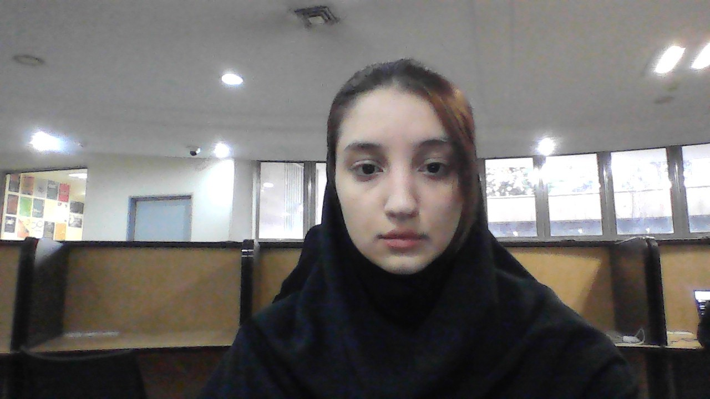

what did dr.Etemadi teach us?

- fractalls in python
- varriables in python
- git clone/add/commit/push/pull
- Azure DevOps
- Editting md Files
- Turtle & Random & Sleep Library
- how to work with memory
- C syntax

